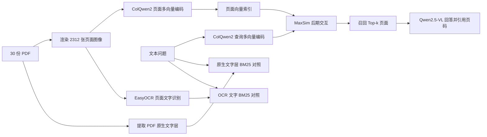

# 基于 ColQwen2 的 PDF 视觉检索与多模态问答

这是一个面向论文、财报、公共报告和技术手册的 PDF 视觉检索与多模态问答原型。项目使用 ColQwen2 直接对完整页面图像建立多向量索引，主检索流程不依赖 OCR，并使用 Qwen2.5-VL 读取召回页面、生成中文答案和页码引用。

> 本项目使用预训练模型完成推理复现和系统评测，没有训练或微调模型。它复现的是 ColPali 系列的视觉页面检索范式，实际检索模型为 `vidore/colqwen2-v1.0-hf`。

## 处理流程



对查询向量与页面视觉向量使用 Late Interaction：

\[
s(q,p)=\sum_i\max_j\langle q_i,p_j\rangle
\]

文档级分数取该 PDF 中最高的页面分数：

\[
S(q,D)=\max_{p\in D}s(q,p)
\]

## 数据集

| 项目 | 数量 |
|---|---:|
| PDF 文档 | 30 |
| 页面 | 2312 |
| 英文页面 | 1856 |
| 中文页面 | 456 |
| 论文 | 214 页 |
| 财务报告 | 671 页 |
| 公共报告 | 887 页 |
| 技术手册 | 540 页 |

数据来源覆盖论文、上市公司年报、国际组织报告和硬件手册。下载地址和领域标签保存在 `pdf_sources.csv`，原始 PDF 不建议提交到 Git 仓库。

## 核心结果

### 文档级检索

在提前确定正确文档的 40 条问题、30 份 PDF、2312 页闭集评测中：

| Recall@1 | Recall@3 | Recall@5 | MRR |
|---:|---:|---:|---:|
| 1.00 | 1.00 | 1.00 | 1.00 |

该结果衡量能否找到正确 PDF，不代表精确答案页达到 100%。

### 严格页面级检索

40 条人工问题均提前确定准确 PDF 页码，不接受相邻页替代；四类文档各 10 条，简单和困难问题各 20 条。

| 方法 | Page R@1 | Page R@3 | Page R@5 | Page MRR |
|---|---:|---:|---:|---:|
| ColQwen2 | **0.90** | **0.975** | **1.00** | **0.9437** |
| PDF 原生文字层 + BM25 | 0.775 | 0.90 | 0.925 | 0.8325 |
| EasyOCR + BM25 | 0.75 | 0.85 | 0.925 | 0.8163 |

相对原生文字层 BM25，ColQwen2 的 R@1 和 MRR 分别提升 0.125 和 0.1112；相对 EasyOCR + BM25 分别提升 0.15 和 0.1274。原生文字层和 OCR 的页面文字非空率分别为 98.75% 和 99.09%，因此视觉检索优势不能简单归因于页面缺少文字。技术手册上 ColQwen2 Page Recall@1 为 100%，两种 BM25 均为 80%；引脚图、机械尺寸图和漫画式页面是差异最明显的案例。

### 答案生成质量

使用 Qwen2.5-VL 对 ColQwen2 的 Top-5 页面生成中文答案。评测包含 12 个语料内可回答问题和 4 个语料中没有答案的问题。12 个回答被拆成 61 个需要回答的关键事实，并逐项对照原页面：

| 指标 | 结果 |
|---|---:|
| 可回答问题 Top-5 检索命中率 | 91.67% |
| 关键事实正确率 | 75.41%（46/61） |
| 回答完整度 | 91.67% |
| 事实得到所引页面支持的比例 | 66.67% |
| 无答案问题正确拒答率 | 100%（4/4） |
| 平均生成时间 | 2.36 秒 |

主要错误来自复杂表格的错行、相邻页面选择错误和引用页不能支持答案，而不是中文输出或引用格式失败。

完整方法、逐题比较、正确页码检查和限制见 [EVALUATION.md](EVALUATION.md)。

可直接用于简历和面试准备的表述见 [RESUME.md](RESUME.md)。

## 环境

实验环境：

- NVIDIA GeForce RTX 5090 32 GB
- Python 3.12.3
- PyTorch 2.8.0 + CUDA 12.8
- Transformers 5.14.1
- colpali-engine 0.3.16
- EasyOCR 1.7.2（仅用于 OCR + BM25 消融基线）
- ColQwen2: `vidore/colqwen2-v1.0-hf`
- 回答模型：`Qwen/Qwen2.5-VL-7B-Instruct`

安装额外依赖：

```bash
pip install -r requirements.txt
```

## 复现流程

### 1. 下载与检查 PDF

```bash
python download_pdfs.py --stage final --timeout 60 --retries 2

python audit_pdf_corpus.py \
  --manifest pdf_sources.csv \
  --pdf-dir data/pdfs \
  --stage final
```

### 2. 渲染页面

```bash
python render_pdfs.py \
  --manifest pdf_sources.csv \
  --stage final \
  --pdf-dir data/pdfs \
  --page-dir data/pages \
  --metadata data/page_metadata.jsonl \
  --dpi 150 \
  --quality 92

python audit_rendered_pages.py \
  --metadata data/page_metadata.jsonl \
  --page-dir data/pages \
  --expected-pages 2312
```

### 3. 构建 ColQwen2 索引

```bash
export HF_HOME=/root/autodl-tmp/cache/huggingface

python build_colqwen2_index.py \
  --metadata data/page_metadata.jsonl \
  --index data/index/colqwen2_v1_hf_final_2312.pt \
  --output-dir outputs/retrieval_final_smoke \
  --batch-size 2 \
  --top-k 5
```

最终索引为 426.6 MiB，2312 页编码耗时 200.5 秒，约 11.5 页/秒。

### 4. 页面级评测

```bash
export HF_HUB_OFFLINE=1

python evaluate_page_retrieval.py \
  --queries page_retrieval_queries_v1_1.csv \
  --metadata data/page_metadata.jsonl \
  --index data/index/colqwen2_v1_hf_final_2312.pt \
  --output outputs/page_retrieval_evaluation_v1_1.json

unset HF_HUB_OFFLINE
```

### 5. BM25 基线

原生 PDF 文本层基线：

```bash
python evaluate_bm25_page_retrieval.py \
  --queries page_retrieval_queries_v1_1.csv \
  --metadata data/page_metadata.jsonl \
  --pdf-dir data/pdfs \
  --text-cache data/index/page_text_cache.jsonl \
  --output outputs/bm25_page_retrieval_evaluation.json
```

真实 OCR 基线从渲染后的页面 JPG 识别文字，不读取 PDF 内置文本层：

```bash
pip install -r requirements-ocr.txt

python build_easyocr_cache.py \
  --metadata data/page_metadata.jsonl \
  --output data/index/easyocr_page_text.jsonl \
  --model-dir data/cache/easyocr \
  --device cuda \
  --batch-size 16 \
  --workers 2

python evaluate_bm25_page_retrieval.py \
  --queries page_retrieval_queries_v1_1.csv \
  --metadata data/page_metadata.jsonl \
  --pdf-dir data/pdfs \
  --text-cache data/index/easyocr_page_text.jsonl \
  --baseline-name easyocr_bm25 \
  --output outputs/easyocr_bm25_page_retrieval_evaluation.json
```

### 6. 启动演示

```bash
export HF_HOME=/root/autodl-tmp/cache/huggingface
export HF_HUB_OFFLINE=1

python demo_app.py \
  --metadata data/page_metadata.jsonl \
  --index data/index/colqwen2_v1_hf_final_2312.pt \
  --port 7860
```

如需在首次问答时加载 Qwen2.5-VL，勾选界面中的“生成中文答案”。仅检索模式只加载 ColQwen2。

## 目录结构

```text
.
├── data/
│   ├── pdfs/
│   ├── pages/
│   ├── page_metadata.jsonl
│   └── index/
├── outputs/
├── pdf_sources.csv
├── render_pdfs.py
├── build_colqwen2_index.py
├── build_easyocr_cache.py
├── evaluate_retrieval.py
├── evaluate_page_retrieval.py
├── evaluate_bm25_page_retrieval.py
├── visual_rag_query.py
└── demo_app.py
```

## 局限

- 页面级评测有 40 条人工问题，答案质量评测有 16 条，结果用于项目验证，不主张统计显著性或通用 SOTA。
- 文档级问题具有较强文档区分度，因此 100% 结果应理解为闭集文档路由能力。
- 当前真实 OCR 消融使用由原生 PDF 渲染出的页面，尚不等同于低分辨率扫描件、倾斜页面或严重噪声文档测试。
- 没有进行领域微调；所有结果来自公开预训练模型的零样本推理。
- Qwen2.5-VL 生成模块的 61 个关键事实正确率为 75.41%，复杂表格仍可能读错行；核心复现和最稳定的量化结论来自 ColQwen2 检索。

## 参考

- [ColPali paper](https://arxiv.org/abs/2407.01449)
- [ColPali repository](https://github.com/illuin-tech/colpali)
- [ColQwen2 model](https://huggingface.co/vidore/colqwen2-v1.0-hf)
- [Qwen2.5-VL model](https://huggingface.co/Qwen/Qwen2.5-VL-7B-Instruct)
